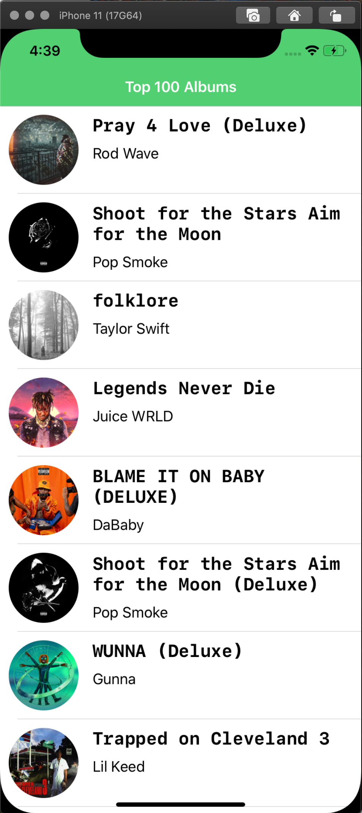

Top 100 Albums Coding Assignment

App Description:
The included application, Top 100 Albums, is a simple demonstration of basic iOS programming abilities on the part of its creator. The application downloads a list of the top 100 albums of various genres from a link created with the Apple RSS feed generator and then presents the information in the form of a tableview. Selecting a cell from the tableview takes the user to a detail view controller with a button to open the album's itunes page.

Requirements:
Display the top 100 albums as returned by the Apple RSS generator link.
Present the information in a tableview, with each cell containing an image and two labels.
Selecting a cell should push a details view controller onto the stack.
Said details view controller should contain a larger image, more labels, and an itunes store button.
Aforementioned itunes store button should be placed at the bottom of the screen 20 points from the screen edges.

Issues:
In its current incarnation, the application does not provide default text the labels in the ListCell object, though this is not expected to be an issue given the predictable completeness of the apple data, this could in theory cause a cell to return an empty string in any of its labels.

